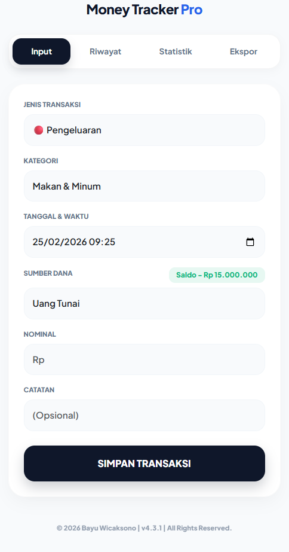
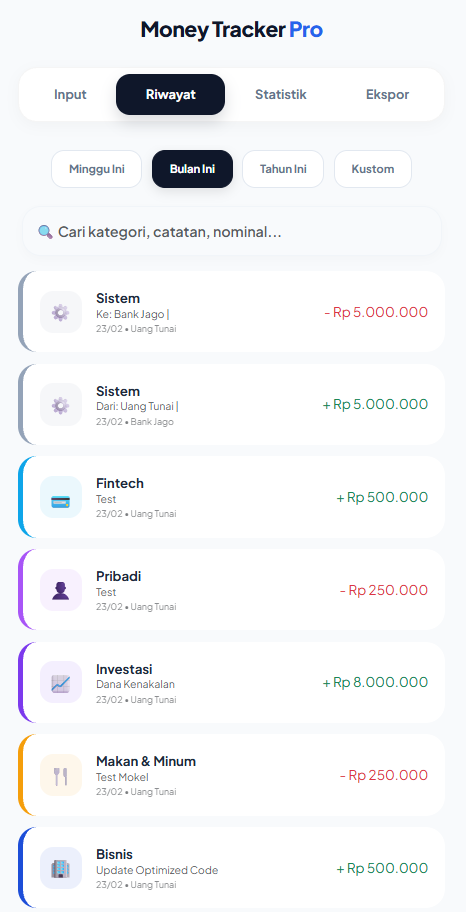
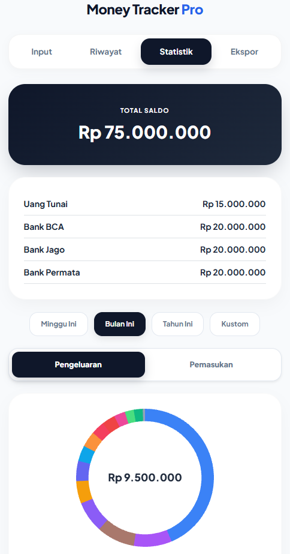
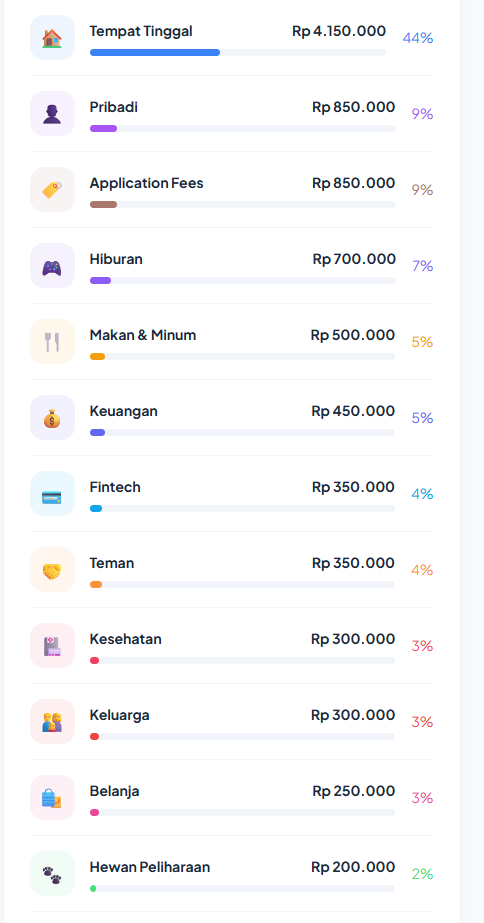
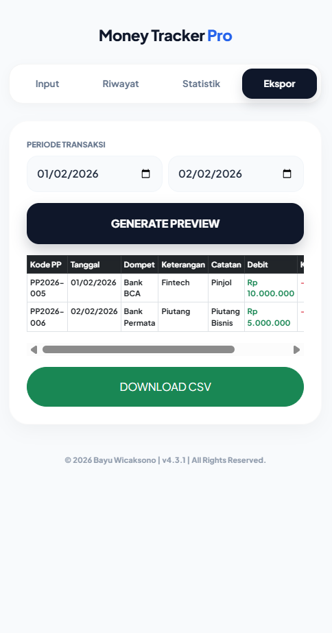
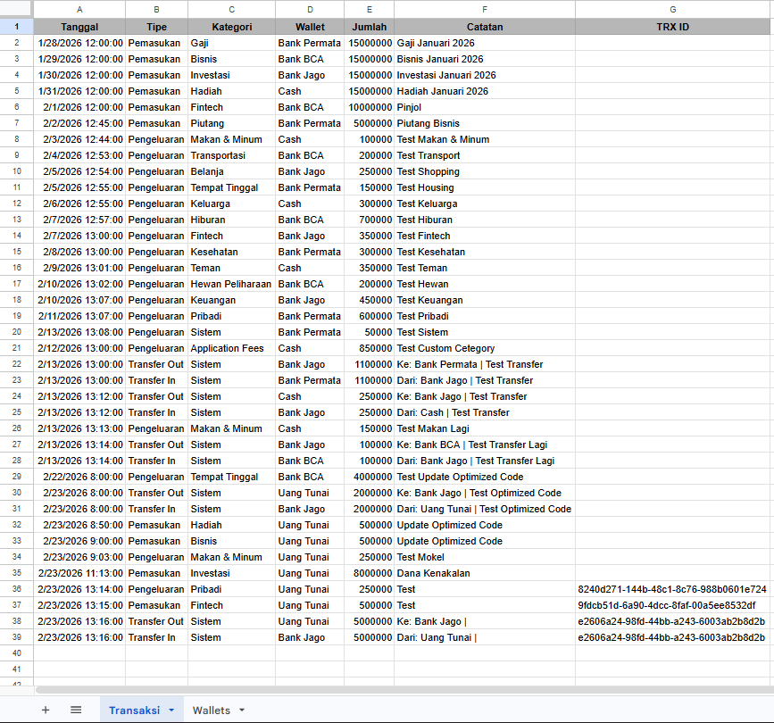
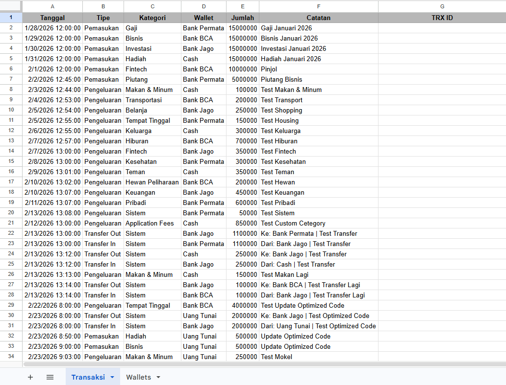
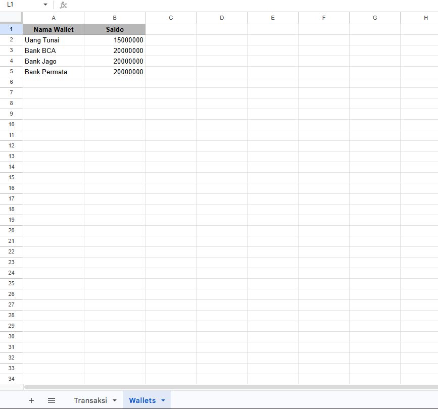

# 💰 Money Tracker Pro

> Web-based personal finance tracker built with **Google Apps Script** and **Google Sheets**.

Money Tracker Pro adalah aplikasi pencatatan keuangan harian berbasis web yang berjalan sepenuhnya di ekosistem Google.
Aplikasi ini dirancang sebagai solusi manajemen keuangan yang:

* ✅ Gratis
* 🔒 Privat
* ⚡ Cepat
* 📱 Mobile-first
* ☁️ Tanpa server eksternal

Database tersimpan langsung di Google Drive milik pengguna.

---

## 📸 Preview

### 💳 Aplication








### 📊 Spreadsheet Database




---

## ✨ Features

### ⚡ Quick Transaction Input

Catat pemasukan, pengeluaran, dan transfer antar wallet dengan UI responsif.

### 💳 Multi Wallet Support

Kelola saldo dari berbagai sumber (Tunai, Bank, E-Wallet).

### 👉 Slide-to-Action UI

Gesture geser untuk edit atau hapus transaksi seperti aplikasi mobile native.

### 📊 Real-time Dashboard

Visualisasi pengeluaran menggunakan interactive doughnut chart.

### 🔍 Advanced Filtering

Filter riwayat berdasarkan periode:

* Mingguan
* Bulanan
* Tahunan
* Custom date range

### 📥 CSV Export

Ekspor laporan keuangan kompatibel dengan Microsoft Excel.

### 🔒 100% Private

Data tersimpan di Google Drive pengguna tanpa server pihak ketiga.

---

## 🏗 Architecture

Aplikasi menggunakan **N-Tier Thin Client Architecture**.

### Tech Stack

| Component       | Technology                             |
| --------------- | -------------------------------------- |
| Backend Runtime | Google Apps Script (V8 Engine)         |
| Database        | Google Sheets API                      |
| Frontend        | Bootstrap 5                            |
| Chart Engine    | Chart.js                               |
| Typography      | Plus Jakarta Sans                      |
| Interaction     | Native JavaScript Touch Events         |
| Security        | Input Sanitization + Server Validation |

---

## 📁 Project Structure

```
/
├── backend/
│   └── Code.gs        # Server-side logic (CRUD & calculation)
├── frontend/
│   └── Index.html     # UI interface
├── screenshots/       # Application preview images
└── README.md
```

---

## ⚙️ Installation Guide

Tidak perlu instal software tambahan.
Cukup gunakan akun Google.

---

### 1️⃣ Setup Database (Google Sheets)

Buat spreadsheet baru dengan struktur berikut.

#### Sheet: `Transaksi`

| Tanggal | Tipe | Kategori | Wallet | Nominal | Catatan | TRX ID |

#### Sheet: `Wallets`

| Nama Wallet | Saldo |

Opsional: isi saldo awal pada sheet `Wallets`.

| Nama Wallet | Saldo |

| Uang Tunai | 10000 |

| Bank BCA | 20000 |

| GoPay | 30000 |

---

### 2️⃣ Setup Google Apps Script

1. Google Sheets → **Extensions → Apps Script**
2. Hapus kode default:

```
function myFunction() {}
```

3. Copy isi:

```
backend/Code.gs
```

4. Tambahkan file HTML bernama:

```
Index
```

5. Copy isi:

```
frontend/Index.html
```

6. Save project.

---

### 3️⃣ Deploy Web App

1. Deploy → New Deployment
2. Pilih Web App
3. Configure:

* Execute as → Me
* Who has access → sesuai kebutuhan

4. Deploy
5. Gunakan URL Web App yang diberikan.

---

## 🔐 Security & Privacy

* Tidak menggunakan server eksternal
* Tidak ada data dikirim ke pihak ketiga
* Data tersimpan di Google Drive pengguna
* Source code dapat diaudit

---

## 📜 License

Copyright © 2026 Bayu Wicaksono
For personal use.

---

## ⭐ Support

Jika project ini membantu, jangan lupa ⭐ repository ini.
